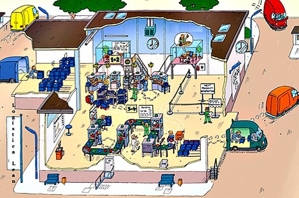
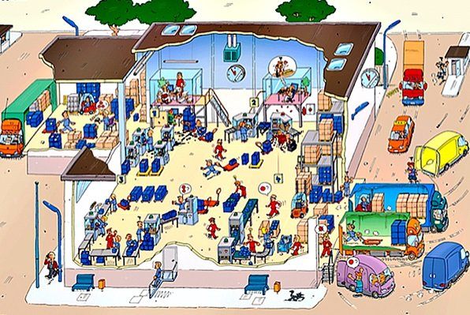
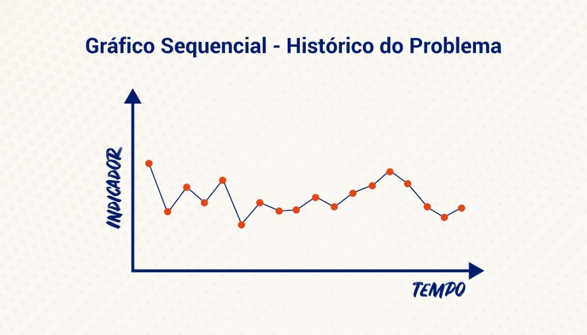
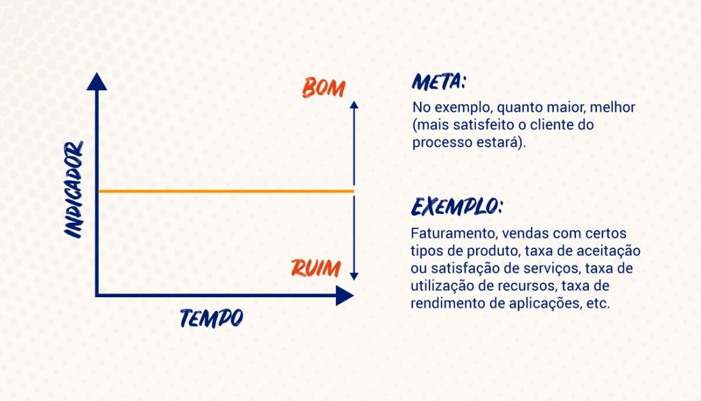
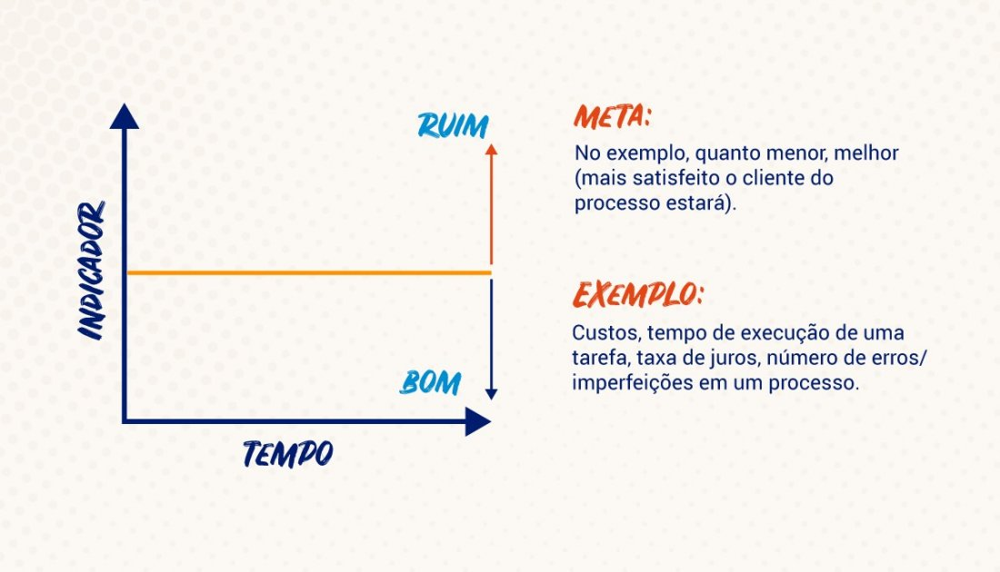
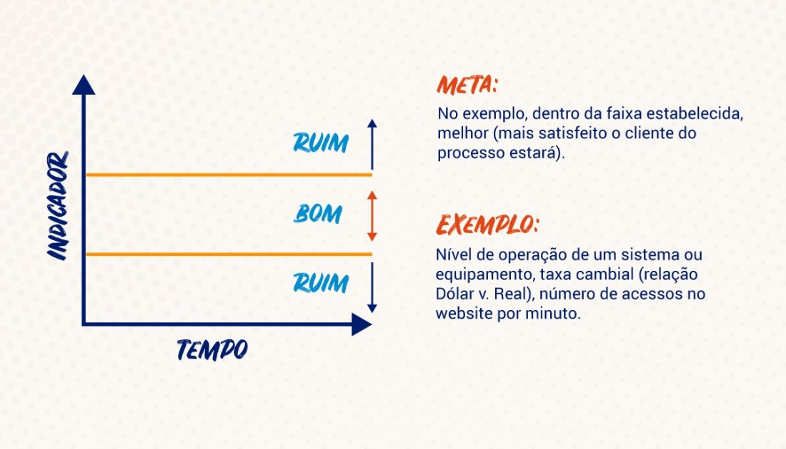
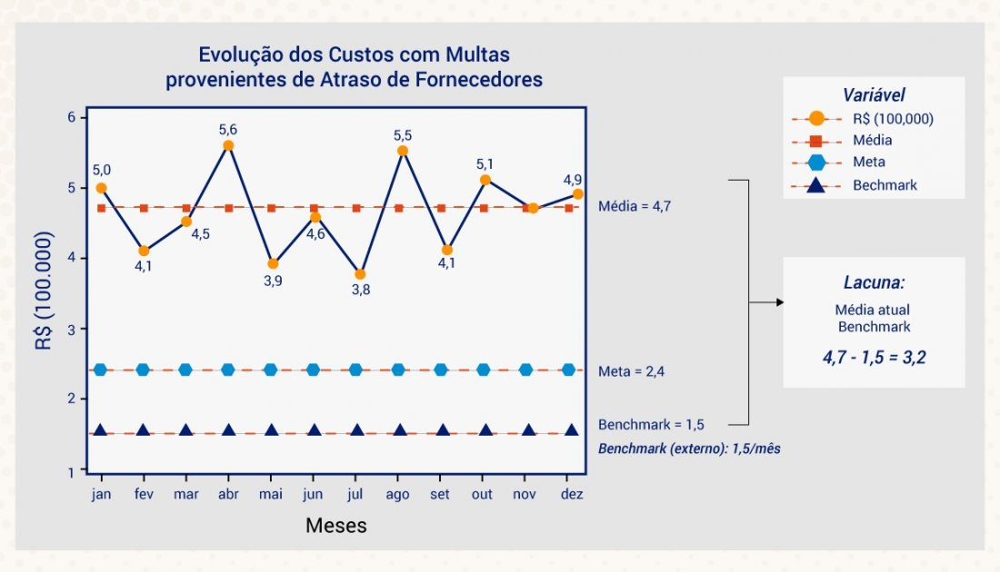
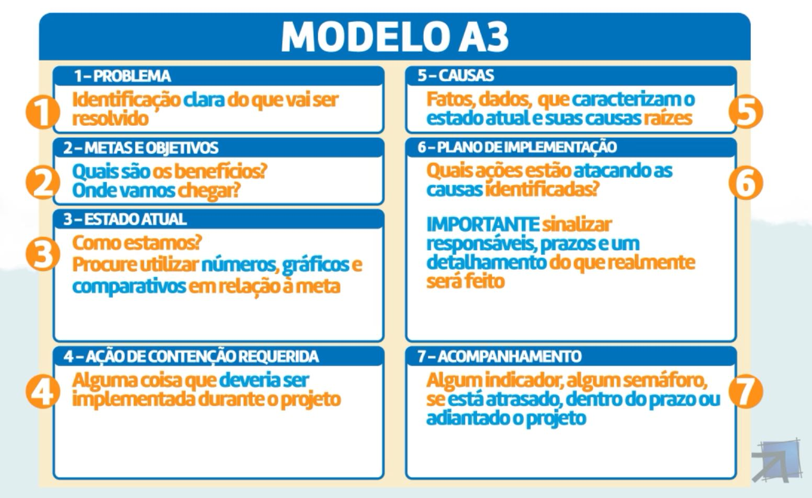

# INTRODUÇÃO

Quando falamos em uma organização, temos alguns elementos que devem estar presentes para garantir seu sucesso ao longo do tempo, como Estratégia, Inovação, Pessoas e Processos.
 
O Lean Six Sigma tem muito em comum com estes elementos em um negócio, mas, ao mesmo tempo, possui uma forma particular, uma metodologia própria de tornar uma empresa extremamente boa naquilo que faz, atingindo níveis de qualidade jamais imagináveis, e o melhor de tudo, de uma forma bastante simples utilizando ferramentas da qualidade conhecidas de grande parte do público e técnicas estatísticas simples.
 
Além disso, a iniciativa Lean Six Sigma gera ganhos muitas vezes maiores do que os investimentos necessários para implementá-la. Neste curso você vai conhecer melhor como funciona a metodologia Lean Six Sigma e o modelo mental que usamos para aplicá-la.
 
**Metodologia é um termo que nos remete a duas palavras: Método (um guia, um procedimento) e Meta (qual o objetivo você quer atingir, qual seu alvo).**
 
Existem diferentes tipos de metodologias, cada uma com seu próprio método. Aqui vamos explorar duas metodologias, o Lean e o Six Sigma e os modelos mentais que estão por trás disto (Lean: Eliminação Desperdícios e Six Sigma: redução de variabilidade através do DMAIC), ou seja, seu caminho para chegar em seu resultado!

## LEAN SIX SIGMA

Surgiu na motorola decada de 80, com o objetivo de redução de custos, ficou famosa na GE.

Modelo mental DEMAIC.

Entender qual origem e causa raiz do problema.

Filosofia Lean ou pensamento enxuto.

Foco no cliente.

Identificar teapas que não agregam valor e tentar elimina-las.

## VISÃO DE PROCESSOS

Maturidade 1: Caótico

Maturidade 2: Organizado

Maturidade 3: Estruturado

Maturidade 4: Gerenciado

Maturidade 5: Excelência operacional

## FLUXO DMAIC

**O que é?**

O modelo mental que está por trás do Six Sigma é o DMAIC, ou seja, um caminho de 5 fases para você desenvolver um Projeto de Melhoria e atingir seus resultados!

**Quando usar?**

Usamos o DMAIC para projetos de melhoria contínua dos processos, tratados como OPEX (Operational Expenditure).
 
**Por que usar?**

Para a redução de variabilidade nos processos, melhoria da qualidade, redução de custos e aumento da satisfação de seus clientes.
 
**Como usar?**

1. Identificar quais processos têm impacto sobre a satisfação do cliente.
2. Levantar as entradas do processo e como se relacionam com os CTQ (características críticas para a qualidade).
3. Medir a habilidade do processo em produzir itens não defeituosos.
4. Avaliar quais atividades de seu processo não agregam valor ao cliente.
5. Encontrar as fontes de variação que aumentam a variabilidade do processo e que são responsáveis pela geração de defeitos.
6. Tomar ação sobre o processo para melhorá-lo, com base nas fontes de variação identificadas.
7. Monitorar as fontes de variação identificadas para manter o novo nível de performance.

DMAIC:

D - Define

M - Meassure

A - Analyse

I - Improve

C - Control

## FILOSOFIA LEAN

**O que é?**

Filosofia desenvolvida por Taiichi Ohno, na Toyota, na década de 40. O sistema integra o Lean Manufacturing, o Just-in-time, o Kanban e o Nivelamento de Produção ou Heijunka. Foi consagrado através do Sistema Toyota de Produção (TPS).
 
**Quando usar?**

Para mapear o fluxo de valor (série de atividades que criam valor e outras que não agregam valor) ou para concluir um serviço ou um produto. Quando necessitamos documentar todas as atividades de um fluxo de valor (mapa), para ver claramente o desperdício e as variações. Deve ser usado como uma ferramenta de planejamento, alinhada com o planejamento estratégico, reduzindo sistematicamente o desperdício e a variação no fluxo de valor.
 
**Por que usar?**

Uma organização enxuta entende o valor do cliente e concentra seus principais processos para aumentá-lo continuamente. O objetivo final é fornecer valor perfeito ao cliente por meio de um processo perfeito de criação de valor que não desperdiça nada. Desta forma, eliminaremos os desperdícios (sem gerar estoques excessivos), baixaremos tempos de espera, superprodução, gargalos de transporte, inventário desnecessário, entre outros.
 
**Como usar?**

1. Inicialmente, selecione o processo de negócio a ser melhorado.
2. Desenvolva o plano e os objetivos de negócios (Business Case), definindo a equipe de trabalho.
3. Mapeie o Fluxo de Valor no estado atual.
4. Selecione a família de serviços ou produtos, defina as etapas do processo e calcule as métricas.
5. Analise o estado atual, revise as fontes de desperdício e identifique quais as oportunidades de melhoria que podem ser implementadas (eliminação de etapas desnecessárias, combinação ou mudança de layout, sequência de atividades, otimização do número de pessoas ou, simplificação e melhoria de procedimentos).
6. Desenvolva uma visão de futuro usando os conceitos Lean como: gerenciamento visual, sistema de fluxo contínuo à prova de falhas e trabalho padronizado.
 
Você consegue perceber a diferença entre empresas com e sem a filosofia LEAN implementada?

LEAN:

SEM LEAN:

## OS 8 DESPERDÍCIOS

-| Manufatura |	Logística | Serviços
----------|------------|------------|----------|
Transporte|Sobrecarga no transporte de materiais e produtos|Falhas de roteirização|Problemas na transmissão de dados, informações
Defeitos|Retrabalho, rejeitos, baixa qualidade|Falta de fornecimento, erros no abastecimento|Erro na informação de um relatório
Estoque|Excesso de WIP (Work In Process)|Excesso de estoque de materiais, peças, produtos|Backlog 
Superprodução|Produzir em excesso|Armazenamento excessivo de produtos acabados|Sobrecarga de informações 
Movimentação|Layout inapropriado|Deslocamentos desnecessários|Falha na busca por documentos, informações
Esperas|Atrasos, tempo ocioso|Atrasos em ordens e entregas|Atrasos, filas de espera 
Processamento Extra	|Requerimentos acima da especificação do cliente|Processos redundantes|Double check 
Intelectual	|Recursos e talentos desperdiçados|Capacidade subutilizada|Alocação incorreta de recursos

# DEFINIÇÃO

Esta fase de um Projeto de Melhoria chama-se DEFINE ou DEFINIÇÃO.
Mas na verdade, o que queremos definir? Inicialmente, defina bem em que queremos trabalhar. Queremos definir o Problema ou o Caso de Negócio (Business Case)? Qual é o Problema e, qual o estado atual do indicador que o representa/mede? Qual a meta/objetivos/benefícios em desenvolvermos este projeto Opex?
 
Nesta etapa, definiremos quem é nosso cliente e quais são suas necessidades, além de quais Processos Internos (visão macro) têm relação com as essas necessidades.
 
Definiremos também:
1. Qual o indicador (KPI – Key Performance Indicator) que melhor representa e mede esta Oportunidade de Melhoria.
2. Quem deverá ser a equipe do Projeto de Melhoria.
3. Qual a Meta de Performance sobre o KPI.
4. Qual o cronograma.
5. Quais os benefícios qualitativos ou quantitativos (savings) do Projeto.

## DEFINIÇÃO DE UM PROJETO

Fontes de definição:

- Desdobramento estratégico de metas
- Análise de custos
- Problemas crônicos

## INDICADOR, META HISTÓRICO

**KPI - Key Performance Indicator (Indicador-chave de Performance)**

É uma medida (valor) que demonstra como está o resultado ou situação do problema, em valor matemático, usado para compor um gráfico sequencial ao longo do tempo, visando mostrar o histórico do problema. Essa medida deve ser indicativa e representativa do problema, confiável e de fácil medição/obtenção.

**Análise de Indicadores**

Com o indicador em mãos, deve-se entender o que o cliente do processo espera do mesmo: meta de performance.
 
Procure associar o valor do indicador e, principalmente, analisar o significado prático do que se está medindo (quanto menor, melhor ou, vice-versa; se é necessário trabalhar em uma faixa de valores, etc).

Uma das tarefas da etapa de DEFINIÇÃO é estabelecermos a META de performance sobre o indicador do Projeto.
 
Precisamos definir uma META sobre nosso indicador (KPI) - na verdade, é um resultado a ser alcançado! Neste ponto, verificaremos para o KPI qual é o Benchmark.
 
Benchmark: É um valor de referência mundial do melhor resultado já alcançado para o indicador.
‍
Tipos de Benchmark:
Benchmark Interno: comparação interna entre diferentes unidades, áreas, etc.
Benchmark Competitivo: comparação com os concorrentes.
Benchmark Funcional: comparação entre mesmas funções de ambientes diferentes.
 
A partir deste ponto, de posse do Benchmark e de sua média, se estabeleceu comparativamente uma diferença interessante denominada Lacuna. Na verdade, quando vamos definir uma meta em Projetos de Melhoria, será estabelecido um percentual de aumento ou de redução desta Lacuna, conforme o projeto que você estará liderando.
‍
Valor da Meta = Situação atual ± (% redução x Lacuna)
Se a direção do Indicador é no sentido de “aumentar”:
Valor da Meta = Situação atual (Média) + (% de aumento x Lacuna)
Se a direção do Indicador é no sentido de “reduzir”
Valor da Meta = Situação atual (Média) - (% de redução x Lacuna)

 
Exemplo: 
 
Supply Chain - Compras

Média dos dados históricos: 4,7

Benchmark externo: 1,5

% da Lacuna a ser atingida: 70%

Lacuna = (Média atual – Benchmark)

Lacuna = 4,7 – 1,5

Lacuna = 3,2
‍
Meta = Média – (Lacuna x % Lacuna)

Meta = 4,7 – (3,2 x 70%)

Meta = 2,5
‍
% de Redução = (Média atual – Meta) / Média atual

% de Redução = (4,7 – 2,5) / 4,7

% de Redução = 47%

Frase de efeito:

**Você só gerencia aquilo que mede**, Peter Drucker

## META SMART

### S

Específica (Specific)
Declaração clara e concisa do que deverá ser alcançado. A meta deve ser fácil para ser entendida e escrita em linguagem simples.
### M
Mensurável (Measurable)

Medida concreta e observável. A meta precisa ter o poder de mostrar se o objetivo foi alcançado ou não.
### A
Atingível (Attainable)

Viável em termos de custos, desafio e tempo. A meta é alcançada com recursos, investimentos e habilidades ou ela é irreal?
### R
Relevante (Realistic)

Relacionada especificamente com os objetivos do processo. A meta deve ser concreta.
### T
Temporizável (Time-Bound)

Inclui um cronograma específico para realização. O tempo referente a meta.
 
**Exemplo de meta SMART:**

“Reduzir em 47% os juros e multas provenientes do atraso de pagamento dos fornecedores, passando de 4,7 (média de janeiro a dezembro) para 2,5 até Dezembro”
Meta = 4,7 – (3,2*0,70)
Meta = 2,5  (redução de 47% da média atual)

## MATRIZ É X NÃO É

### O que é?
Ferramenta que ajuda a documentar quaisquer contrastes que irão ajudar a definir um rumo para a investigação do problema.

### Quando usar?
Use sempre que você e seu time estiverem entendendo o escopo, restrições e definição de um projeto sobre algo que será melhorado.

### Por que usar?
Além de ajudar a definir o escopo e a extensão do problema, auxilia o time a focar em questões que devem ser respondidas, primeiro.

### Como usar?
Reúna as informações em uma tabela:

-|-|É|NÃO É|	 	DIFERENÇAS
--|---|----|----|-----
Qual|	Qual objetivo? Qual o defeito?	 	 	 	  	 
Onde?| Onde geograficamente? Onde no objeto?	 	 	 	 	 	 	 	 	 	 	 
Quando?|	Quando, em horas ou dias? Quando, dentro do processo?	 	 
Quanto?|	Quantos objetivos? Quantos defeitos por objeto?	 	 	 	 	  	 
Como?|	Algum padrão de ocorrência?	Qual o tamanho do defeito?	 	 	 	 	 
#

**Questão:** pergunte quando, como, onde, quem, quantos e quais, sob todos os pontos de vista relevantes.

**Coluna É:** indique as respostas que são suspeitas de causarem o problema.

**Coluna Não É:** indique as respostas que provavelmente não causam o problema.

**Coluna Diferenças:** indique as diferenças particulares entre as respostas das 2 colunas anteriores para definir rumos à investigação do problema.

**Dicas:**

1. Questione-se sobre toda a informação que você tem, referente ao problema: se os problemas apresentam diferenças, este método pode prover alguns pontos de partida para a investigação.
2. Foque em qualquer característica única ou específica do problema: algo que só acontece em uma peça; algo que só acontece em uma linha; algo que só acontece sob certas condições.

## SIPOC

Na melhoria de processos, um SIPOC (às vezes COPIS) é uma ferramenta que resume as entradas e saídas de um ou mais processos em forma de tabela. A sigla SIPOC significa suppliers (fornecedores), inputs (entradas), process (processo), outputs (saídas) e customers (clientes), que formam as colunas da tabela.[1][2] Essa sigla estava em uso pelo menos desde os programas de gestão de qualidade total do final da década de 1980 e continua a ser usada hoje em Seis Sigma, lean manufacturing (manufatura enxuta) e gestão de processos de negócios.

Para enfatizar colocando as necessidades do cliente em primeiro lugar, a ferramenta é às vezes chamada de COPIS e as informações do processo são preenchidas começando com o cliente e trabalhando até o fornecedor.

O SIPOC é muitas vezes apresentado no início dos esforços de melhoria de processos, como em eventos Kaizen ou durante a fase de "definição" do processo DMAIC.[3] Tem três usos mais comuns, dependendo do público-alvo:

Para dar uma visão geral de alto nível às pessoas que não estão familiarizados com o processo.
Para recordar as pessoas cuja familiaridade com o processo se desvaneceu ou se tornou desatualizada devido às mudanças no processo.
Para ajudar as pessoas na definição de um novo processo.
Vários aspectos do SIPOC que podem não ser aparentes de imediato são:

Fornecedores (suppliers) e clientes (customers) podem ser internos ou externos à organização que executa o processo.
Entradas (inputs) e saídas (outputs) podem ser materiais, serviços ou informações.
O foco está em capturar o conjunto de entradas e saídas, e não as etapas individuais do processo.

## FORMULÁRIO A3

***O que é?***

É uma maneira de registrarmos o nosso trabalho, tudo que estamos fazendo e já fizemos, em um projeto ou iniciativa de melhoria.
Além disso, é uma grande ferramenta para comunicação interna, junto à equipe, gestores e a organização.

***Quando usar?***

Funciona como ferramenta de controle e acompanhamento do projeto, que vem sendo executado.
Serve, também, como registro (histórico) do que já foi efetuado, em relação àquele problema.

***Por que usar?***

Auxilia nos registros e resumo gerencial sobre os principais avanços do seu projeto/ iniciativa de melhoria.

